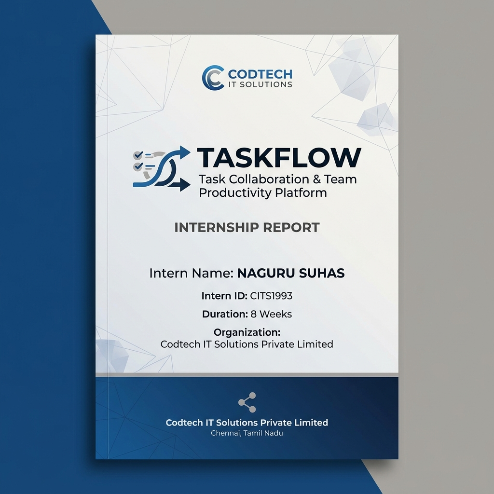
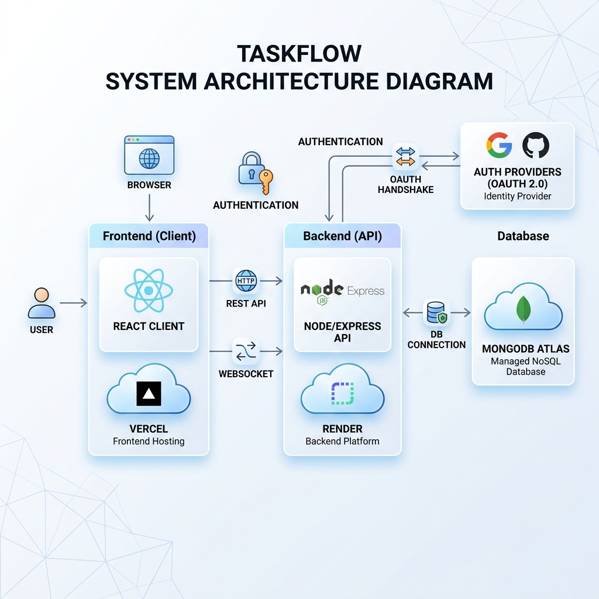
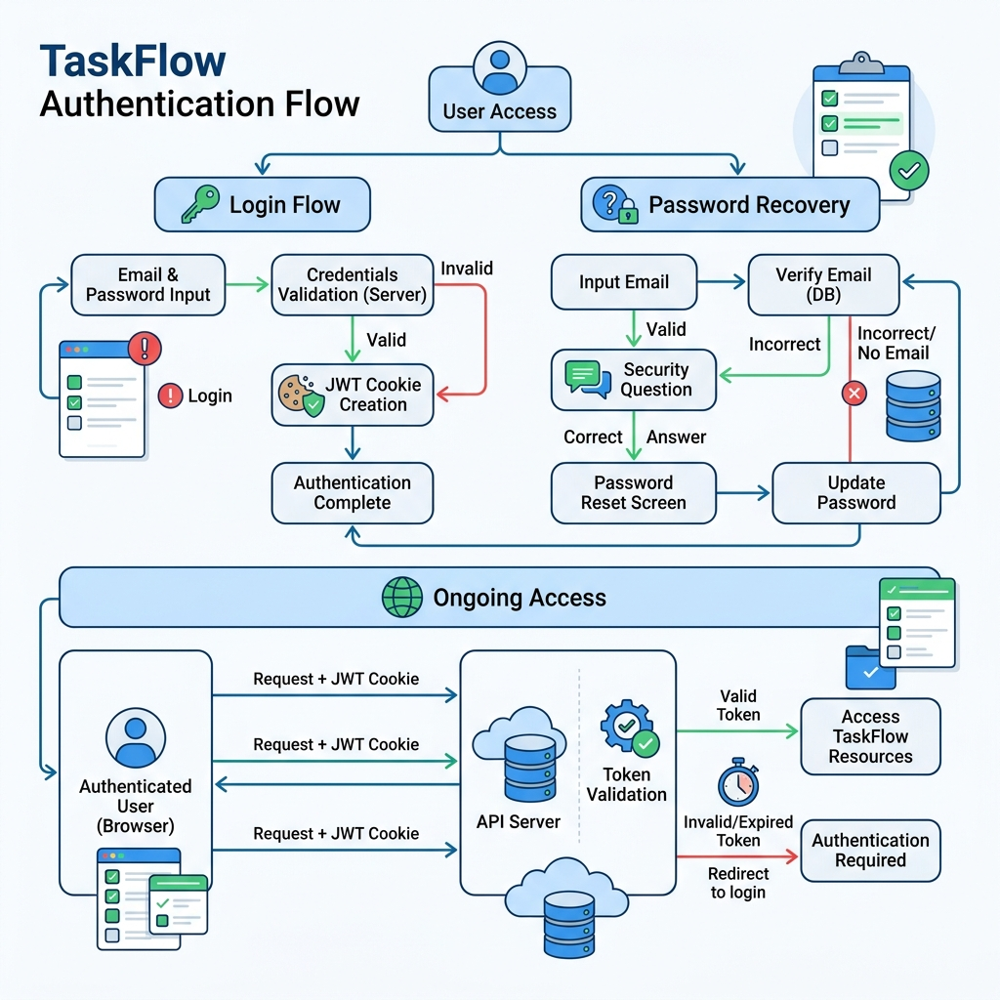
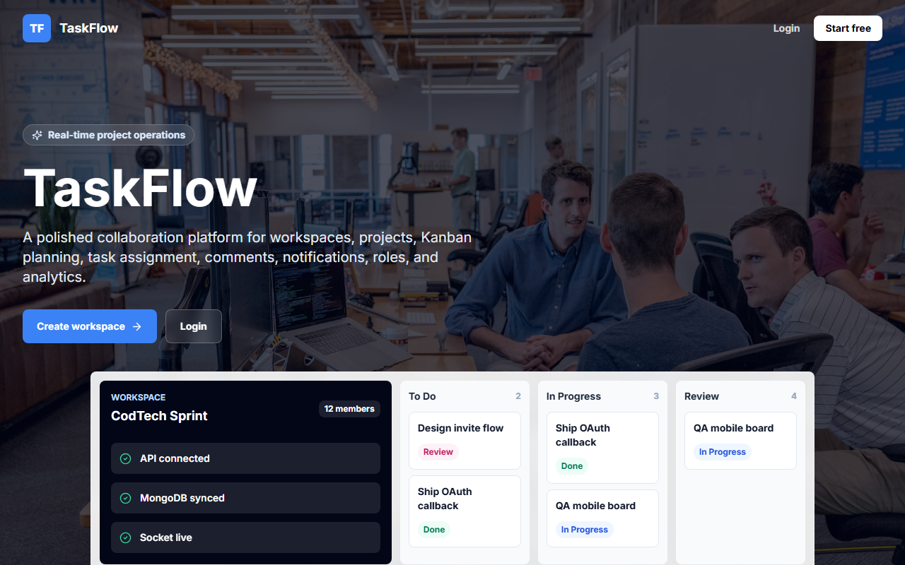
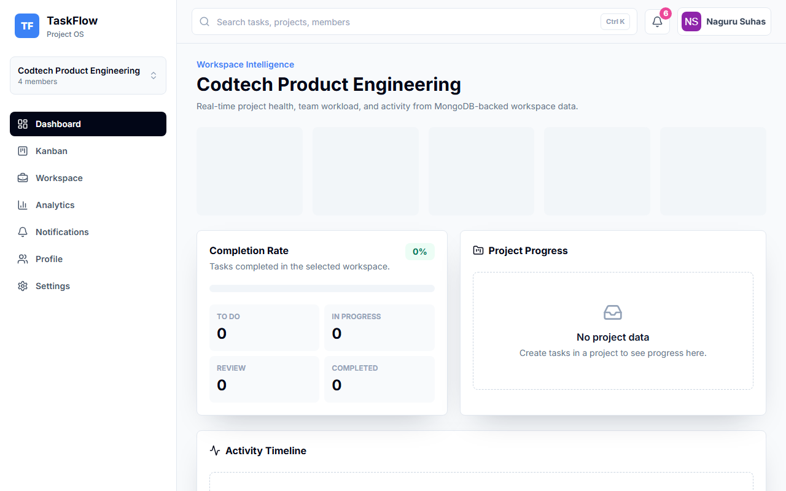
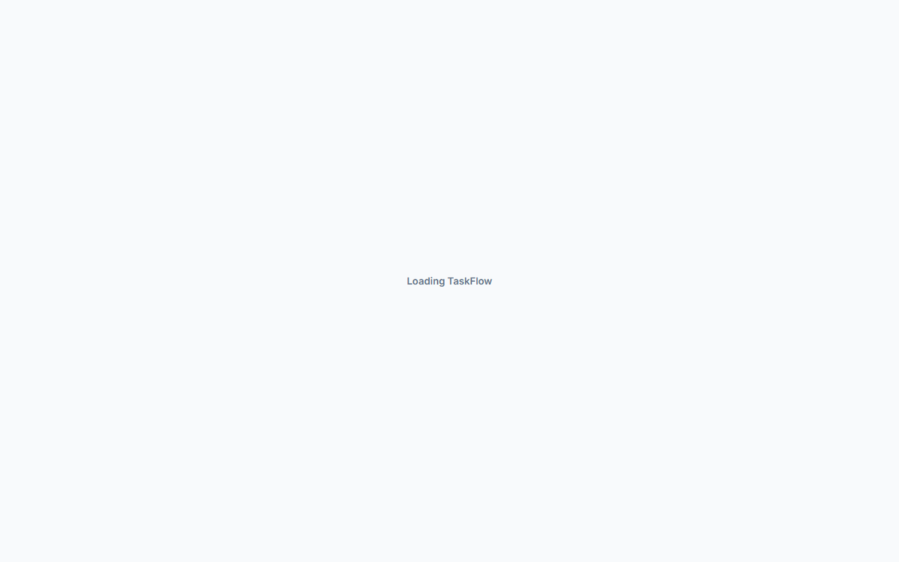

# Project Documentation

## 1. Cover Page

**Project Title:** TaskFlow – Task Collaboration & Team Productivity Platform  
**Organization:** Codtech IT Solutions Private Limited  
**Author:** Naguru Suhas (Intern ID: CITS1993)  
**Role:** Full-Stack Development Intern  
**Date:** June 2026  


---

## 2. Internship Details

* **Intern ID:** CITS1983  
* **Intern Full Name:** Sai Pranavi  
* **Organization:** Codtech IT Solutions Private Limited  
* **Domain:** Full-Stack Web Development  
* **Duration:** 8 Weeks (April 2026 – June 2026)  

---

## 3. Organization Details

**Codtech IT Solutions Private Limited** is a modern software solutions and talent development company focused on delivering premium IT consulting, custom software products, and hands-on professional internships in high-demand technologies including Full-Stack Web Development, Data Science, Cyber Security, and Cloud Computing.

---

## 4. Project Abstract

**TaskFlow** is a modern, production-grade task collaboration and team productivity platform designed to support agile workflows. The application enables teams to organize their work through workspaces, manage multiple project boards, and visualize tasks using a dynamic Kanban drag-and-drop board. 

By integrating secure JSON Web Token (JWT) session handling, Google OAuth authentication, recovery question logic, real-time WebSocket communication, role-based access control (RBAC), and custom analytics reports, TaskFlow replicates the density and quality of professional SaaS platforms.

---

## 5. Project Objectives

1. **Structured Team Collaboration:** Deliver a scalable workspaces and projects hierarchy enabling teams to isolate project resources.
2. **Dynamic Work Tracking:** Provide a drag-and-drop Kanban board reflecting instantaneous updates across team members.
3. **Robust Security & Session Management:** Implement production-grade user authentication using HTTP-only cookies, password recovery via security questions, and Google OAuth callback logic.
4. **Granular Access Controls:** Formulate a strict Role-Based Access Control (RBAC) mechanism defining actions for Owners, Admins, and Members.
5. **Real-time Synchronization:** Establish WebSockets (Socket.io) handling board changes and notification delivery.
6. **Data-Driven Insights:** Generate executive dashboard reports analyzing task completion rates, workload distribution, and team timelines.

---

## 6. Project Scope

The scope of TaskFlow encompasses a complete full-stack web application:
* **Frontend:** Responsive React SPA utilizing Vite, Zustand, Tailwind CSS, Framer Motion, and Recharts.
* **Backend:** REST API built with Express and Node.js, utilizing Passport.js for OAuth, Mongoose for ODM, and Socket.io for real-time networking.
* **Database:** NoSQL MongoDB Atlas cloud cluster tracking users, workspaces, projects, tasks, comments, notifications, and logs.
* **QA & Verification:** Comprehensive Playwright End-to-End automation testing suite verifying auth, RBAC, workspaces, and collaboration.

---

## 7. Technology Stack

* **Frontend Framework:** React (v18.3.1) via Vite (v8.0.16)
* **Styling & Transitions:** Tailwind CSS, Framer Motion
* **State Management:** Zustand (v4.5.4)
* **Client-Side Fetching:** Axios, TanStack React Query (v5)
* **Kanban Drag-and-Drop:** React Beautiful DND (v13.1.1)
* **Visual Analytics:** Recharts (v2.12.7)
* **Backend Server:** Node.js, Express.js (v4.19.2)
* **Database:** MongoDB Atlas, Mongoose ODM (v8.5.3)
* **Real-time Layer:** Socket.io (v4.7.5)
* **Authentication:** JWT (jsonwebtoken v9), Passport.js (Google OAuth2.0 Strategy)
* **Security Middleware:** Helmet, CORS, Express Rate Limit, BcryptJS
* **E2E Testing:** Playwright (v1.49.1)

---

## 8. System Architecture

TaskFlow uses a modern Client-Server decoupled architecture:

```
+-------------------------------------------------------------+
|                     React Client (Vercel)                   |
|  - Pages (Dashboard, Kanban, Workspaces, Profile)           |
|  - Store (Zustand) & Queries (React Query)                  |
|  - Real-time Connection (Socket.io Client)                  |
+------------------------------+------------------------------+
                               |
                   HTTP / WS   |   REST Requests / Event streams
                               v
+-------------------------------------------------------------+
|                     Node / Express API Server (Render)      |
|  - Controllers (Auth, Workspaces, Tasks, Analytics)         |
|  - Middleware (RBAC, Error Handlers, Security)              |
|  - Services (Socket.io, Notification Delivery)              |
+------------------------------+------------------------------+
                               |
                               |   Mongoose ODM (JSON)
                               v
+-------------------------------------------------------------+
|                     MongoDB Atlas Cluster (Database)        |
|  - Collections: Users, Workspaces, Projects, Tasks,         |
|                 Comments, Notifications, Activities         |
+-------------------------------------------------------------+
```


---

## 9. Folder Structure

```
taskflow/
├── client/
│   ├── src/
│   │   ├── components/       # UI, layout, Topbar, and Kanban boards
│   │   ├── hooks/            # Custom React Query fetching hooks
│   │   ├── lib/              # Axios instance, normalizers, socket client
│   │   ├── pages/            # Page templates (Dashboard, Board, Login)
│   │   └── store/            # Zustand stores for auth & active states
├── server/
│   ├── src/
│   │   ├── config/           # DB, Passport, and Env configuration
│   │   ├── controllers/      # Route handlers implementing business logic
│   │   ├── middleware/       # Auth, RBAC enforcement, error catchers
│   │   ├── models/           # Mongoose schemas for collections
│   │   ├── routes/           # Express endpoint router registrations
│   │   └── services/         # Socket event handlers & notifications
├── screenshots/              # Visual captures of pages in app
├── output-images/            # Visual captures of success states
├── documentation/            # PDF and markdown guides
└── tests/
    └── e2e/                  # Playwright spec sheets and fixtures
```

---

## 10. Database Design

TaskFlow employs MongoDB for flexible document tracking, structured via Mongoose ODM.

### User Schema (`User.js`)
* `name`: String (Required)
* `username`: String (Unique, Sparse)
* `email`: String (Unique, Required)
* `password`: String (Select: false)
* `providers`: Object { `google`: String }
* `securityQuestion`: String (Enum of pre-configured questions)
* `securityAnswerHash`: String (Bcrypt hashed, Select: false)

### Workspace Schema (`Workspace.js`)
* `name`: String (Required)
* `description`: String
* `owner`: ObjectId (Ref: User, Required)
* `members`: Array [ { `user`: ObjectId (Ref: User), `role`: String (Owner/Admin/Member) } ]
* `inviteCode`: String (Unique)

### Project Schema (`Project.js`)
* `workspace`: ObjectId (Ref: Workspace, Required)
* `title`: String (Required)
* `description`: String
* `status`: String (Enum: Planning/Active/Archived)
* `members`: Array [ ObjectId (Ref: User) ]
* `createdBy`: ObjectId (Ref: User)

### Task Schema (`Task.js`)
* `workspace`: ObjectId (Ref: Workspace, Required)
* `project`: ObjectId (Ref: Project, Required)
* `title`: String (Required)
* `description`: String
* `status`: String (Enum: To Do/In Progress/Review/Completed)
* `priority`: String (Enum: Low/Medium/High/Critical)
* `assignedUser`: ObjectId (Ref: User)
* `dueDate`: Date
* `tags`: Array [ String ]
* `createdBy`: ObjectId (Ref: User)

### Comment Schema (`Comment.js`)
* `task`: ObjectId (Ref: Task, Required)
* `user`: ObjectId (Ref: User, Required)
* `body`: String (Required)

### Notification Schema (`Notification.js`)
* `user`: ObjectId (Ref: User, Required)
* `workspace`: ObjectId (Ref: Workspace)
* `type`: String (Enum: Task Assigned/Task Completed/Comment Added/Member Joined)
* `title`: String (Required)
* `body`: String
* `unread`: Boolean (Default: true)
* `entity`: Object { `kind`: String, `id`: ObjectId }

---

## 11. API Design

All endpoints reside under `/api` and enforce JSON structures:

| Endpoint | Method | Middleware | Description |
|---|---|---|---|
| `/auth/register` | POST | RateLimit | User signup + creates default workspace |
| `/auth/login` | POST | RateLimit | User login, signs and cookies JWT token |
| `/auth/me` | GET | RequireAuth | Returns details of authenticated user |
| `/workspaces` | GET | RequireAuth | Lists all workspaces user is member of |
| `/workspaces` | POST | RequireAuth | Creates a workspace with caller as Owner |
| `/workspaces/:id/invitations` | POST | RequireAdmin | Generates a signed signup/invite URL |
| `/:workspaceId/projects` | GET | RequireAuth | Lists projects inside a workspace |
| `/:workspaceId/projects` | POST | RequireAdmin | Creates a new project in the workspace |
| `/:workspaceId/projects/:pId/tasks` | POST | RequireAdmin | Adds a task inside a specific project |
| `/:workspaceId/projects/:pId/tasks/:tId`| PATCH | RequireEditTask| Updates task fields or changes status |
| `/:workspaceId/tasks/:tId/comments` | POST | RequireAuth | Adds a comment to a task card |
| `/notifications` | GET | RequireAuth | Fetches notifications list for user |
| `/analytics/dashboard` | GET | RequireAuth | Generates numbers for completions, charts |

---

## 12. Authentication Flow

```
+-----------+            1. POST Credentials            +------------+
|           | ----------------------------------------> |            |
|   React   |                                           |  Express   |
|   Client  | <---------------------------------------- |    Server  |
|           |         2. Set-Cookie JWT Cookie          |            |
+-----------+                                           +------------+
      |                                                        |
      | 3. Subsequent Request with JWT Cookie                  |
      +-------------------------------------------------------->
```


* **Password Hashing:** Passwords are dynamically hashed using `bcryptjs` with 12 salt rounds before database persistence.
* **JWT Delivery:** Upon credentials matching, server signs a JWT containing user ID and writes it in an HTTP-only, secure, same-site `Lax` cookie named `taskflow_token`.
* **Password Recovery:** If a user loses their password, they supply their email, retrieve their pre-selected Security Question, and answer it. The server verifies the Bcrypt-hashed answer and returns a 30-minute transient `resetToken` authorizing them to set a new password.

---

## 13. Google OAuth Flow

TaskFlow delegates single-sign-on (SSO) to Google using Passport:
1. Client initiates OAuth by clicking the Google button, opening `/api/auth/google`.
2. Backend redirects to Google Consent screen using Google client credentials.
3. User logs in, Google callbacks to `/api/auth/google/callback` with profile details.
4. Passport resolves the email, matches/creates the user in MongoDB, establishes their default workspace, and generates a session JWT.


5. Server redirects the browser window back to the client dashboard (`/dashboard`), passing the cookie securely.

---

## 14. RBAC Design

TaskFlow enforces strict role checks on API and UI layers:

| Action | Owner | Admin | Member |
|---|:---:|:---:|:---:|
| Delete Workspace | **Yes** | No | No |
| Promote/Demote Members | **Yes** | No | No |
| Edit Workspace Settings | **Yes** | No | No |
| Create Projects | **Yes** | **Yes** | No |
| Edit Projects | **Yes** | **Yes** | No |
| Invite New Teammates | **Yes** | **Yes** | No |
| Create & Assign Tasks | **Yes** | **Yes** | No |
| View Boards and Feeds | **Yes** | **Yes** | **Yes** |
| Update Assigned Task Status | **Yes** | **Yes** | **Yes** |
| Add Comments to Tasks | **Yes** | **Yes** | **Yes** |

---

## 15. Features

1. **Agile workspaces:** High-level buckets isolating teams and directories.
2. **Interactive Kanban Board:** Beautifully styled columns with task priority and assignee avatars.
3. **Real-time Synchronization:** Socket.io listeners update the board instantaneously for all users inside the project room.
4. **Data Visualizations:** Interactive Stat Cards and Recharts tracking workload distribution.
5. **Robust Notifications:** Notifications trigger when assigned a task, mentioned in comment, or upon invitation acceptance.
6. **Dark Mode Integration:** Coherent theme switching using Tailwind class hooks.

---

## 16. Screenshots & Output Images

### Landing Page


### Kanban Board


### Analytics Dashboard


### Workspace Management


---

## 17. Deployment Architecture

* **Frontend:** Hosted on **Vercel** as a Static Web App. Rewrites are configured in `vercel.json` to route single-page router endpoints back to `index.html`.
* **Backend:** Deployed as a web service on **Render**, running Node.js. Environment variables (like JWT secrets, Google OAuth tokens, and database URIs) are wired directly in Render dashboard configs.
* **Database:** Hosted on **MongoDB Atlas** in a multi-region Shared Tier cluster.


---

## 18. Testing Strategy

The QA strategy is built on double-validation:
1. **Manual Smoke Testing:** Verifying password recoveries, OAuth popups, and dark mode triggers.
2. **Automated E2E Testing:** Handled by Playwright browser test runners, mocking database environments and checking route blockings.

---

## 19. Playwright E2E Testing

Playwright tests run in isolated context files inside `/tests/e2e`:
* `taskflow.fixture.js`: Spawns a REST API helper client and configures authentication cookies.
* `taskflow.spec.js`: Evaluates registration, login, workspaces switches, Kanban task updates, and API-enforced RBAC blocks.
* `screenshots.spec.js`: Custom automation script logging into the demo database, creating workspaces, boards, and saving 29 images into correct repository folders.

---

## 20. Security Measures

* **Token Isolation:** Access tokens are stored exclusively in HTTP-Only, Lax SameSite cookies, shielding the app from Cross-Site Scripting (XSS).
* **Rate Limiting:** Express Rate Limit caps IP requests at 600 per 15 minutes to block DDoS or brute-force attempts.
* **Helmet.js Integration:** Injects secure HTTP headers preventing iframe clickjacking and cross-site scripting.
* **Origin Checkers:** Custom middleware validates `Origin` headers against allowed client lists.

---

## 21. Challenges Faced

1. **State Hydration:** Synchronizing local Zustand states, React Query caches, and incoming real-time Socket.io messages. Solved by standardizing React Query invalidation upon socket events.
2. **OAuth Local Testing:** Testing Google OAuth locally requires callback routes mapped to `http://localhost:5000`. Resolved by configuring conditional callback URLs depending on environment flags.

---

## 22. Future Enhancements

* **Workspace Multi-tenancy Billing:** Stripe integration for workspace seat upgrades.
* **Gantt Charts View:** Timeline visualization showing project task sequences.
* **Slack & MS Teams Webhooks:** Dispatch notifications to outer messaging channels on key workspace updates.

---

## 23. Conclusion

**TaskFlow** represents a professional, portfolio-grade project management application. Under the 8-week internship at Codtech IT Solutions Private Limited, Naguru Suhas successfully engineered the database schemas, built Express controllers, designed a beautiful responsive interface, configured JWT and Google OAuth authentication mechanisms, and secured the system using modern middleware, completing all criteria for a successful internship submission.
